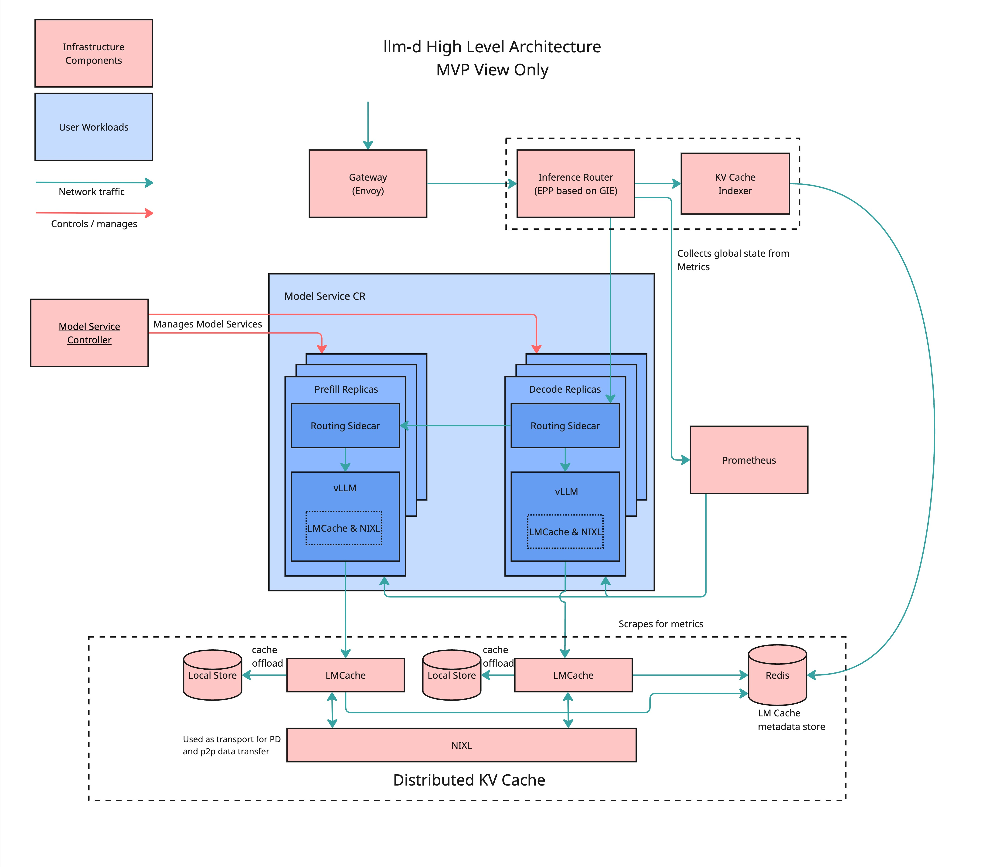

# llm-d Quick Start

Getting Started with llm-d on Kubernetes.

## Overview

This guide will walk you through the steps to install and deploy llm-d on a Kubernetes cluster.

**What is llm-d?**

llm-d is an open source project providing distributed inferencing for GenAI runtimes on any Kubernetes cluster. Its highly performant, scalable architecture helps reduce costs through a spectrum of hardware efficiency improvements. The project prioritizes ease of deployment+use as well as SRE needs + day 2 operations associated with running large GPU clusters.

It includes:

- Prefill/decode disaggregation
- KV Cache distribution, offloading and storage hierarchy
- AI-aware router with plug points for customizable scorers
- Operational telemetry for production, prometheus/grafana
- Kubernetes-based, works on OCP, minikube, and other k8s distributions
- NIXL inference transfer library

**llm-d consists of the following components:**

- Gateway API Inference Extension (GIE) - This extension upgrades an ext-proc-capable proxy or gateway - such as Envoy Gateway, kGateway, or the GKE Gateway - to become an inference gateway - supporting inference platform teams self-hosting large language models on Kubernetes. This integration makes it easy to expose and control access to your local OpenAI-compatible chat completion endpoints to other workloads on or off cluster, or to integrate your self-hosted models alongside model-as-a-service providers in a higher level AI Gateway like LiteLLM, Solo AI Gateway, or Apigee.
  The inference gateway:
  - Improves the tail latency and throughput of LLM completion requests against Kubernetes-hosted model servers using an extendable request scheduling algorithm that is kv-cache and request cost aware, avoiding evictions or queueing as load increases
  - Provides Kubernetes-native declarative APIs to route client model names to use-case specific LoRA adapters and control incremental rollout of new adapter versions, A/B traffic splitting, and safe blue-green base model and model server upgrades
  - Adds end to end observability around service objective attainment
  - Ensures operational guardrails between different client model names, allowing a platform team to safely serve many different GenAI workloads on the same pool of shared foundation model servers for higher utilization and fewer required accelerators

- Distributed KV Cache
  - LMCache (in llm-d container)
  - NIXL (in llm-d container)
  - KVCache Indexer
  - Redis

- Model Service Controller - ModelService is a Kubernetes operator (CRD + controller) that enables the creation of vllm pods and routing resources for a given model.
  - Enables disaggregated prefill
  - Supports creation of Gateway API Inference Extension resources for routing
  - Supports auto-scaling with HPA
  - Supports independent scaling of prefill and decode instances
  - Supports independent node affinities for prefill and decode instances
  - Supports model loading from OCI images, HuggingFace public and private registries, and PVCs

- Metrics Service (Prometheus)

### Architecture



## Hardware Profiles

Tested on:

- Minikube on AWS
  - single g6e.12xlarge
- Red Hat OpenShift on AWS
  - 6 x m5.4xlarge
  - 2 x g6e.2xlarge
  - OpenShift 4.17.21
  - NVIDIA GPU Operator 24.9.2
  - OpenShift Data Foundation 4.17.6

## Client Configuration

### Required tools

Following prerequisite are required for the installer to work.

- [yq (mikefarah) – installation](https://github.com/mikefarah/yq?tab=readme-ov-file#install)
- [jq – download & install guide](https://stedolan.github.io/jq/download/)
- [git – installation guide](https://git-scm.com/book/en/v2/Getting-Started-Installing-Git)
- [Helm – quick-start install](https://helm.sh/docs/intro/install/)
- [Kustomize – official install docs](https://kubectl.docs.kubernetes.io/installation/kustomize/)
- [kubectl – install & setup](https://kubernetes.io/docs/tasks/tools/install-kubectl/)

You can use the installer script that installs all the required dependencies.  Currently only Linux is supported.

```bash
# Currently Linux only
./install-deps.sh
```

### Required credentials and configuration

- [llm-d-deployer GitHub repo – clone here](https://github.com/llm-d/llm-d-deployer.git)
- [ghcr.io Registry – sign-up & credentials](https:/github.com/)
- [Red Hat Registry – terms & access](https://access.redhat.com/registry/)
- [HuggingFace HF_TOKEN](https://huggingface.co/docs/hub/en/security-tokens) with download access for the model you want to use.  By default the sample application will use [meta-llama/Llama-3.2-3B-Instruct](https://huggingface.co/meta-llama/Llama-3.2-3B-Instruct).
  > ⚠️ You may need to visit Hugging Face [meta-llama/Llama-3.2-3B-Instruct](https://huggingface.co/meta-llama/Llama-3.2-3B-Instruct) and
  > accept the usage terms to pull this with your HF token if you have not already done so.

Registry Authentication: The installer looks for an auth file in:

```bash
~/.config/containers/auth.json
# or
~/.config/containers/config.json
```

If not found, you can create one with the following commands:

Create with Docker:

```bash
docker --config ~/.config/containers/ login ghcr.io
```

Create with Podman:

```bash
podman login ghcr.io --authfile ~/.config/containers/auth.json
```

### Target Platforms

#### Kubernetes

This can be run on a minimum ec2 node type [g6e.12xlarge](https://aws.amazon.com/ec2/instance-types/g6e/) (4xL40S 48GB but only 2 are used by default) to infer the model meta-llama/Llama-3.2-3B-Instruct that will get spun up.

> ⚠️ If your cluster has no available GPUs, the **prefill** and **decode** pods will remain in **Pending** state.

Verify you have properly installed the container toolkit with the runtime of your choice.

```bash
# Podman
podman run --rm --security-opt=label=disable --device=nvidia.com/gpu=all ubuntu nvidia-smi
# Docker
sudo docker run --rm --runtime=nvidia --gpus all ubuntu nvidia-smi
```

#### OpenShift

- OpenShift - This quickstart was tested on OpenShift 4.18. Older versions may work but have not been tested.
- NVIDIA GPU Operator and NFD Operator - The installation instructions can be found [here](https://docs.nvidia.com/datacenter/cloud-native/openshift/latest/steps-overview.html).
- OpenShift Data Foundation - The installation instructions can be found [here](https://docs.redhat.com/en/documentation/red_hat_openshift_data_foundation/4.17/html/deploying_and_managing_openshift_data_foundation_using_red_hat_openstack_platform/deploying_openshift_data_foundation_on_red_hat_openstack_platform_in_internal_mode).  OF is not required, but a ReadWriteMany storage class is required.
- NO Service Mesh or Istio installation as it will conflict with the gateway

## llm-d Installation

The llm-d-deployer contains all the helm charts necessary to deploy llm-d. To facilitate the installation of the helm charts, the `llmd-installer.sh` script is provided. This script will populate the necessary manifests in the `manifests` directory.
After this, it will apply all the manifests in order to bring up the cluster.

The llmd-installer.sh script aims to simplify the installation of llm-d using the llm-d-deployer as it's main function.  It scripts as many of the steps as possible to make the installation process more streamlined.  This includes:

- Installing the GAIE infrastructure
- Creating the namespace with any special configurations
- Creating the pull secret to download the images
- Creating storage and downloading the model
- Creating the model service CRDs
- Applying the helm charts
- Deploying the sample app (model service)

It also supports uninstalling the llm-d infrastructure and the sample app.

Before proceeding with the installation, ensure you have completed the prerequisites and are able to issue kubectl commands to your cluster by configuring your `~/.kube/config` file or by using the `oc login` command.

### Usage

The installer needs to be run from the `llm-d-deployer/quickstart` directory.

```bash
./llmd-installer.sh [OPTIONS]
```

### Flags

| Flag                           | Description                                                                                             | Example                                                          |
|--------------------------------|---------------------------------------------------------------------------------------------------------|------------------------------------------------------------------|
| `--hf-token TOKEN`             | HuggingFace API token (or set `HF_TOKEN` env var)                                                       | `./llmd-installer.sh --hf-token "abc123"`                        |
| `--auth-file PATH`             | Path to your registry auth file ig not in one of the two listed files in the auth section of the readme | `./llmd-installer.sh --auth-file ~/.config/containers/auth.json` |
| `--storage-size SIZE`          | Size of storage volume (default: 7Gi)                                                                   | `./llmd-installer.sh --storage-size 15Gi`                        |
| `--skip-download-model`        | Skip downloading the model to PVC if modelArtifactURI is pvc based                                      | `./llmd-installer.sh --skip-download-model`                      |
| `--storage-class CLASS`        | Storage class to use (default: efs-sc)                                                                  | `./llmd-installer.sh --storage-class ocs-storagecluster-cephfs`  |
| `--namespace NAME`             | Kubernetes namespace to use (default: `llm-d`)                                                          | `./llmd-installer.sh --namespace foo`                            |
| `--values-file NAME`           | Absolute path to a Helm values.yaml file (default: llm-d-deployer/charts/llm-d/values.yaml)             | `./llmd-installer.sh --values-file /path/to/values.yaml`         |
| `--uninstall`                  | Uninstall llm-d and cleanup resources                                                                   | `./llmd-installer.sh --uninstall`                                |
| `--disable-metrics-collection` | Disable metrics collection (Prometheus will not be installed)                                           | `./llmd-installer.sh --disable-metrics-collection`               |
| `-h`, `--help`                 | Show help and exit                                                                                      | `./llmd-installer.sh --help`                                     |

## Examples

### Install llm-d on an Existing Kubernetes Cluster

The storage class used for AWS ec2 is `efs-sc`. Modify [model-storage-rwx-pvc.yaml](../helpers/k8s/model-storage-rwx-pvc.yaml)
for a different type.

```bash
export HF_TOKEN="your-token"
./llmd-installer.sh
```

### Install on OpenShift with OF installed

Before running the installer, ensure you have logged into the cluster.  For example:

```bash
oc login --token=sha256~yourtoken --server=https://api.yourcluster.com:6443
```

The installer will create a ReadWriteMany PVC and download the model to it, if you are using OF, you can pass in the `--storage-class ocs-storagecluster-cephfs` flag.

```bash
export HF_TOKEN="your-token"
./llmd-installer.sh --storage-class ocs-storagecluster-cephfs --storage-size 15Gi
```

### Validation

#### A Simple Request

The inference-gateway serves as the HTTP ingress point for all inference requests in our deployment.
It’s implemented as a Kubernetes Gateway (`gateway.networking.k8s.io/v1`) using either kgateway or istio as the
gatewayClassName, and sits in front of your inference pods to handle path-based routing, load balancing, retries,
and metrics. This example validates that the gateway itself is routing your completion requests correctly.
You can execute the [`test-request.sh`](test-request.sh) script to test completions, or run the following commands
manually.

```bash
NAMESPACE=llm-d
MODEL_ID=meta-llama/Llama-3.2-3B-Instruct
GATEWAY_ADDRESS=$(kubectl get gateway -n ${NAMESPACE} | tail -n 1 | awk '{print $3}')
kubectl run --rm -i curl-temp --image=curlimages/curl --restart=Never -- \
  curl -X POST \
  "http://${GATEWAY_ADDRESS}/v1/completions" \
  -H 'accept: application/json' \
  -H 'Content-Type: application/json' \
  -d '{
    "model": "'${MODEL_ID}'",
    "messages": [{"content": "Who are you?", "role": "user"}],
    "stream": false
  }'
```

> If you receive an error indicating PodSecurity "restricted" violations when running the smoke-test script, you
> need to remove the restrictive PodSecurity labels from the namespace. Once these labels are removed, re-run the
> script and it should proceed without PodSecurity errors.
> Run the following command:

```bash
kubectl label namespace <NAMESPACE> \
  pod-security.kubernetes.io/warn- \
  pod-security.kubernetes.io/warn-version- \
  pod-security.kubernetes.io/audit- \
  pod-security.kubernetes.io/audit-version-
```

### Bring Your Own Model

There is a default sample application that by loads [`meta-llama/Llama-3.2-3B-Instruct`](https://huggingface.co/meta-llama/Llama-3.2-3B-Instruct)
based on the sample application [values.yaml](../charts/llm-d/values.yaml) file. If you want to swap that model out with
another [vllm compatible model](https://docs.vllm.ai/en/latest/models/supported_models.html). Simply modify the
values file with the model you wish to run.

Here is an example snippet of the default model values being replaced with
[`meta-llama/Llama-3.2-1B-Instruct`](https://huggingface.co/meta-llama/Llama-3.2-1B-Instruct).

```yaml
  model:
    # -- Fully qualified pvc URI: pvc://<pvc-name>/<model-path>
    modelArtifactURI: pvc://llama-3.2-1b-instruct-pvc/models/meta-llama/Llama-3.2-1B-Instruct

    # # -- Fully qualified hf URI: pvc://<pvc-name>/<model-path>
    # modelArtifactURI: hf://meta-llama/Llama-3.2-3B-Instruct

    # -- Name of the model
    modelName: "Llama-3.2-1B-Instruct"

    # -- Aliases to the Model named vllm will serve with
    servedModelNames: []

    auth:
      # -- HF token auth config via k8s secret. Required if using hf:// URI or not using pvc:// URI with `--skip-download-model` in quickstart
      hfToken:
        # -- If the secret should be created or one already exists
        create: true
        # -- Name of the secret to create to store your huggingface token
        name: llm-d-hf-token
        # -- Value of the token. Do not set this but use `envsubst` in conjunction with the helm chart
        key: HF_TOKEN
```

### Metrics Collection

llm-d includes built-in support for metrics collection using Prometheus and Grafana. This feature is enabled by default but can be disabled using the
`--disable-metrics-collection` flag during installation. In OpenShift, llm-d applies ServiceMonitors for llm-d components that trigger Prometheus
scrape targets for the built-in user workload monitoring Prometheus stack.

#### Accessing the Metrics UIs

If running in OpenShift, skip to [Option 3: OpenShift](#option-3-openshift).

##### Option 1: Port Forwarding (Default)

Once installed, you can access the metrics UIs through port-forwarding:

- Prometheus UI (port 9090):

```bash
kubectl port-forward -n llm-d-monitoring --address 0.0.0.0 svc/prometheus-kube-prometheus-prometheus 9090:9090
```

- Grafana UI (port 3000):

```bash
kubectl port-forward -n llm-d-monitoring --address 0.0.0.0 svc/prometheus-grafana 3000:80
```

Access the UIs at:

- Prometheus: <http://YOUR_IP:9090>
- Grafana: <http://YOUR_IP:3000> (default credentials: admin/admin)

##### Option 2: Ingress (Optional)

For production environments, you can configure ingress for both Prometheus and Grafana. Add the following to your values.yaml:

```yaml
prometheus:
  ingress:
    enabled: true
    annotations:
      kubernetes.io/ingress.class: nginx
    hosts:
      - prometheus.your-domain.com
    tls:
      - secretName: prometheus-tls
        hosts:
          - prometheus.your-domain.com

grafana:
  ingress:
    enabled: true
    annotations:
      kubernetes.io/ingress.class: nginx
    hosts:
      - grafana.your-domain.com
    tls:
      - secretName: grafana-tls
        hosts:
          - grafana.your-domain.com
```

##### Option 3: OpenShift

If you're using OpenShift with user workload monitoring enabled, you can access the metrics through the OpenShift console:

1. Navigate to the OpenShift console
2. In the left navigation bar, click on "Observe"
3. You can access:
   - Metrics: Click on "Metrics" to view and query metrics using the built-in Prometheus UI
   - Targets: Click on "Targets" to see all monitored endpoints and their status

The metrics are automatically integrated into the OpenShift monitoring stack, providing a seamless experience for viewing and analyzing your llm-d metrics.
The llm-d-deployer does not install Grafana in OpenShift, but it's recommended that users install Grafana to view metrics and import dashboards.

Follow the [OpenShift Grafana setup guide](https://github.com/llm-d/llm-d/blob/dev/observability/openshift/README.md#step-2-set-up-grafana-optional)
The guide includes manifests to install the following:

- Grafana instance
- Grafana Prometheus datasource from user workload monitoring stack
- Grafana llm-d dashboard

#### Available Metrics

The metrics collection includes:

- Model inference performance metrics
- Request latency and throughput
- Resource utilization (CPU, memory, GPU)
- Cache hit/miss rates
- Error rates and types

#### Security Note

When running in a cloud environment (like EC2), make sure to:

1. Configure your security groups to allow inbound traffic on ports 9090 and 3000 (if using port-forwarding)
2. Use the `--address 0.0.0.0` flag with port-forward to allow external access
3. Consider setting up proper authentication for production environments
4. If using ingress, ensure proper TLS configuration and authentication
5. For OpenShift, consider using the built-in OAuth integration for Grafana

### Troubleshooting

The various images can take some time to download depending on your connectivity. Watching events
and logs of the prefill and decode pods is a good place to start.

### Uninstall

This will remove llm-d resources from the cluster. This is useful, especially for test/dev if you want to
make a change, simply uninstall and then run the installer again with any changes you make.

```bash
./llmd-installer.sh --uninstall
```
